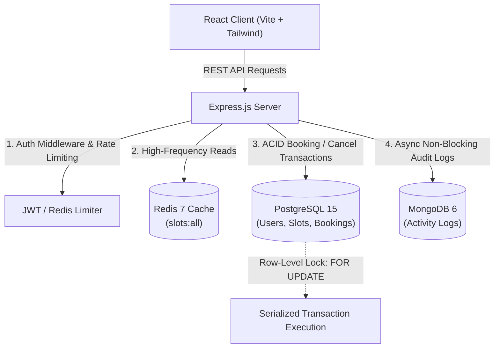
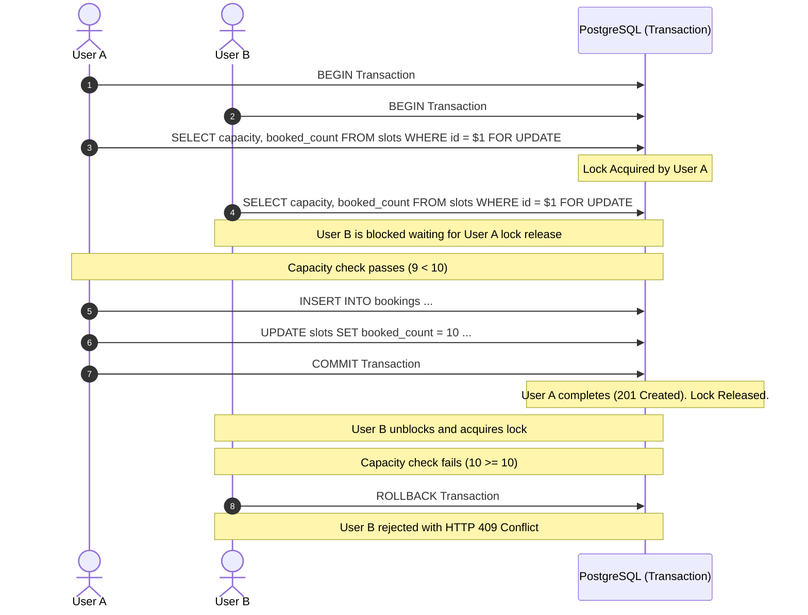

# FitSlot — High-Concurrency Gym Slot Booking System

<p align="left">
  
  
  
  
  
  
  
</p>

A production-ready full-stack gym reservation platform designed to eliminate overbooking under heavy concurrent traffic. Built with **React**, **Node.js/Express**, **PostgreSQL**, **MongoDB**, **Redis**, and containerized with **Docker Compose**.

---

## 📌 Key Engineering Highlights

- **Concurrency-Safe Engine**: Employs PostgreSQL row-level locks (`SELECT ... FOR UPDATE`) inside atomic transactions to strictly enforce the 10-person capacity limit under simultaneous booking bursts.
- **Dual-Database Architecture**: PostgreSQL functions as the ACID transactional source of truth; MongoDB handles high-throughput asynchronous activity and audit logs (`REGISTER`, `LOGIN`, `BOOK_SLOT`, `CANCEL_BOOKING`).
- **Low-Latency Read Path**: High-frequency slot availability queries are cached in Redis with instant transaction-driven invalidation.
- **Layered Service Architecture**: Strict separation of concerns (Routes → Validation Middleware → Controllers → Service Layer → Database Clients).
- **Graceful Lifecycle Management**: Clean connection pool draining, Redis teardown, and operational health checks.

---

## 🏛 System Architecture



---

## 🔒 Concurrency Strategy & Race Condition Prevention

### The Challenge
When a gym slot has **1 spot remaining** (`booked_count = 9`, `capacity = 10`) and 3 users attempt to book at the exact same millisecond:
- **Unsafe systems** read `booked_count = 9` across all 3 threads simultaneously, approve all 3 reservations, and increment the count to `12` (overbooking).
- **FitSlot** serializes write attempts at the row level.

### Execution Flow



### SQL Transaction Implementation

```sql
BEGIN;

-- 1. Acquire exclusive row-level lock on target slot
SELECT id, capacity, booked_count 
FROM slots 
WHERE id = $1 
FOR UPDATE;

-- 2. Verify capacity in business logic:
-- If booked_count >= capacity => ROLLBACK & return 409 Conflict

-- 3. Create active booking record
INSERT INTO bookings (user_id, slot_id, status) 
VALUES ($2, $1, 'ACTIVE');

-- 4. Atomically increment slot booked count
UPDATE slots 
SET booked_count = booked_count + 1, updated_at = CURRENT_TIMESTAMP 
WHERE id = $1;

COMMIT;
```

### Duplicate Booking Prevention
A partial unique index at the database level prevents a single user from holding duplicate active reservations for the same slot:

```sql
CREATE UNIQUE INDEX unique_active_booking 
ON bookings (user_id, slot_id) 
WHERE status = 'ACTIVE';
```

---

## 🗃 Database Schemas

### PostgreSQL (Transactional Data)

```
users (id, name, email, password_hash, created_at, updated_at)
  │
  ├──< bookings (id, user_id, slot_id, status, created_at, cancelled_at, updated_at)
  │
slots (id, date, start_time, end_time, capacity, booked_count, created_at, updated_at)
```

| Table | Primary Key | Key Columns & Indexes | Description |
| :--- | :--- | :--- | :--- |
| `users` | `id` (UUID) | `email` (UNIQUE) | User identity and password credentials |
| `slots` | `id` (UUID) | `date`, `start_time`, `booked_count` | Available training time slots (Default capacity: 10) |
| `bookings` | `id` (UUID) | `unique_active_booking` partial index | Reservation records (`ACTIVE` or `CANCELLED`) |

---

### MongoDB (Audit & Activity Collection)

```json
{
  "_id": "ObjectId('65d8f1e29c8e1a0012ab34cd')",
  "userId": "3fa85f64-5717-4562-b3fc-2c963f66afa6",
  "action": "BOOK_SLOT",
  "slotId": "8a32b384-2191-4df2-bc6d-74d1a29367c1",
  "bookingId": "c71120f2-e567-4f11-9a76-0bf17cb3d119",
  "timestamp": "2026-08-26T10:00:00.000Z",
  "metadata": {}
}
```

---

## ⚡ Redis Caching & Invalidation Flow

- **Cache-Aside Pattern**: `GET /api/slots` checks Redis key `slots:all` before querying PostgreSQL. 
- **TTL**: Keys expire automatically after 60 seconds.
- **Write Invalidation**: Upon any successful booking or cancellation, `slots:all` and `slots:{slotId}` are invalidated immediately.
- **Resilience**: If Redis experiences latency or outage, queries automatically fall back to PostgreSQL without interrupting user operations.

---

## 📡 REST API Reference

All responses follow a standard envelope format:

```json
{
  "success": true,
  "statusCode": 200,
  "message": "Operation completed successfully",
  "data": {}
}
```

### Endpoints

| Method | Route | Description | Auth |
| :--- | :--- | :--- | :---: |
| `POST` | `/api/auth/register` | Register new user account | No |
| `POST` | `/api/auth/login` | Authenticate credentials and receive Bearer JWT | No |
| `GET` | `/api/slots` | List all slots with live capacity meters (Cached) | No |
| `GET` | `/api/slots/:id` | Get details of a single slot | No |
| `POST` | `/api/bookings` | Reserve a gym slot (Row-locked, Rate-limited) | **Yes** |
| `GET` | `/api/bookings/my` | Retrieve bookings of authenticated user | **Yes** |
| `DELETE` | `/api/bookings/:id` | Cancel reservation & restore capacity | **Yes** |
| `GET` | `/api/health` | Health check & service connection status | No |

---

## 🛠 Local Setup & Running

### Prerequisites
- [Docker Desktop](https://www.docker.com/) (running with WSL 2 on Windows)
- [Node.js](https://nodejs.org/) (v18+)

### 1. Clone Repository
```bash
git clone https://github.com/manyapatkar974/GYM_SLOT.git
cd GYM_SLOT
```

### 2. Start Infrastructure
Launch PostgreSQL, MongoDB, and Redis in isolated containers:
```bash
docker compose up -d
```

### 3. Backend Setup
```bash
cd backend
npm install

# Initialize PostgreSQL tables and unique indexes
npm run db:init

# Seed initial slots (6:00 AM to 8:00 PM)
npm run db:seed

# Start the API server
npm run start
```
*Backend runs on `http://localhost:5000`.*

### 4. Frontend Setup
In a new terminal window:
```bash
cd frontend
npm install
npm run dev
```
*Frontend runs on `http://localhost:5173`.*

---

## 🧪 Concurrency Stress Testing

An automated verification test is provided in `backend/concurrency-test.js`.

```bash
cd backend
npm run test:concurrency
```

### Test Demonstration
1. Initializes a slot with `capacity = 10` and `booked_count = 9` (only 1 open spot).
2. Fires 3 simultaneous booking requests via `Promise.all()`.
3. Verifies assertions:
   - **Exactly 1 request** succeeds with `201 Created`.
   - **Exactly 2 requests** fail with `409 Conflict`.
   - Final PostgreSQL row `booked_count` is **strictly 10**.

```
📊 Concurrent Request Execution Results:
┌─────────┬───────────────┬─────────┬────────────────────────────┬────────────┐
│ (index) │     user      │ status  │           reason           │ durationMs │
├─────────┼───────────────┼─────────┼────────────────────────────┼────────────┤
│    0    │ 'Athlete One' │ 'SUCCESS'│ 'BOOKED_CONFIRMED (201)'   │     12     │
│    1    │ 'Athlete Two' │ 'FAILED' │ 'SLOT_FULL (409 Conflict)' │     15     │
│    2    │ 'Athlete Three│ 'FAILED' │ 'SLOT_FULL (409 Conflict)' │     16     │
└─────────┴───────────────┴─────────┴────────────────────────────┴────────────┘

🔍 Verification Assertions:
   - Expected Successes: 1 | Actual: 1
   - Expected Rejections: 2 | Actual: 2
   - Final Slot Booked Count: 10 / 10

✅ TEST PASSED: Zero overbooking detected. Row-level locks verified!
```

---

## ⚖️ Design Decisions & Trade-offs

| Decision | Rationale | Trade-off |
| :--- | :--- | :--- |
| **Native `pg` Pool over ORM** | Guarantees direct control over explicit transaction lifecycle and row-level locks (`SELECT ... FOR UPDATE`). | Requires writing raw parameterized SQL queries instead of auto-generated ORM models. |
| **Dual Database Pattern** | Decouples high-volume audit logging (MongoDB) from transactional operations (PostgreSQL). | Increases infrastructure surface area to maintain two separate databases. |
| **Pessimistic Row-Locking** | Guarantees strict serialization under peak booking load without retry loops. | Slight latency increase during high write contention compared to optimistic locking. |

---

## 📈 Scalability to 100x Traffic

To scale this platform for enterprise loads:
1. **Stateless API Clustering**: Run multiple Express instances behind an Application Load Balancer (ALB / NGINX).
2. **PostgreSQL Read Replicas**: Direct `GET /api/slots` cache-miss reads to read replicas, preserving the primary master solely for write transactions.
3. **Connection Pooling**: Deploy **PgBouncer** to pool client connections and prevent connection exhaustion.
4. **Distributed Redis Cluster**: Shard Redis cache and rate limit counters across multiple availability zones.
